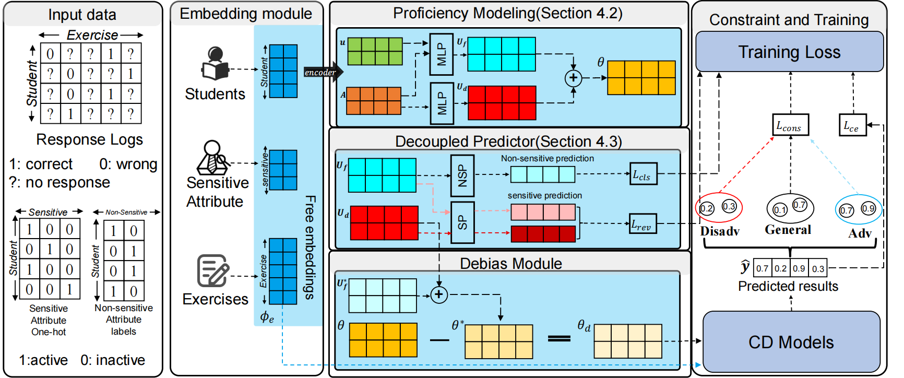

# Path-Specific Causal Reasoning for Fairness-aware Cognitive Diagnosis


## introduction
This is the dataset and code for our paper.

## dataset
The dataset is located in the 'datasets' directory. We partitioned the dataset according to the standard 7:1:2 ratio. 'dataset_info.json' contains some statistical information about the dataset.

## method
More detailed information can be found in the paper.

## code
You can easily train using 'train.sh', just be mindful of the path issues.
```
sh train.sh
```

